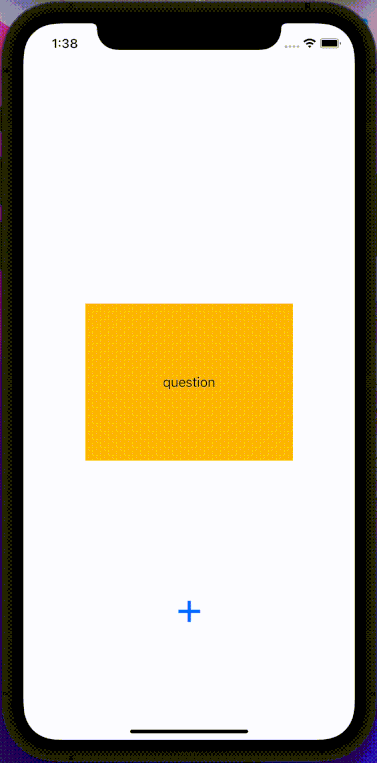
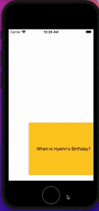

📝 `NOTE` Paste this template at the top of your existing `README.md` file from the last lab.

## Lab 2

### App Description
Simple Flashcard app that lets you customize question and answer

### App Walk-though

 

## Required
- [x] User can open the creation screen
- [x] User can cancel out of the creation screen
- [x] User can enter a new question and answer in the creation screen to then show it on the flashcard
- [x] Push code to GitHub
## Optional
- [ ] User gets an error if they try to create a new flashcard with no question or answer 
    (\*\* I kind of did this, users cannot create blank flashcards but no error popup is raised)
- [ ] User can edit existing flashcard
- [ ] User can add multiple choice answers in the creation screen
## Flashcard App

📝 `NOTE:` Paste the README templates for each subsequent lab here at the top, (i.e. lab 2, 3, 4). This will show a history of your development process including which users stories you completed and how your app looked and functioned at each step.

## Lab 1

### App Description
A flashcard app that shows question and answer when tapped

### App Walk-though

 

## Required
- [x] Create New Project in Xcode
- [x] Add a view for the front side of the flashcard to display the question
- [x] Add a view for the back side of the flashcard to display the answer
- [x] Build in logic to show the answer side when the card is tapped
- [x] Push code to GitHub
## Optional
- [ ] Toggle the flashcard between the question side and the answer side
- [ ] Style the question and answer side of the card to better distinguish between the two sides
- [ ] Add selectable multiple choice answers beneath the card
